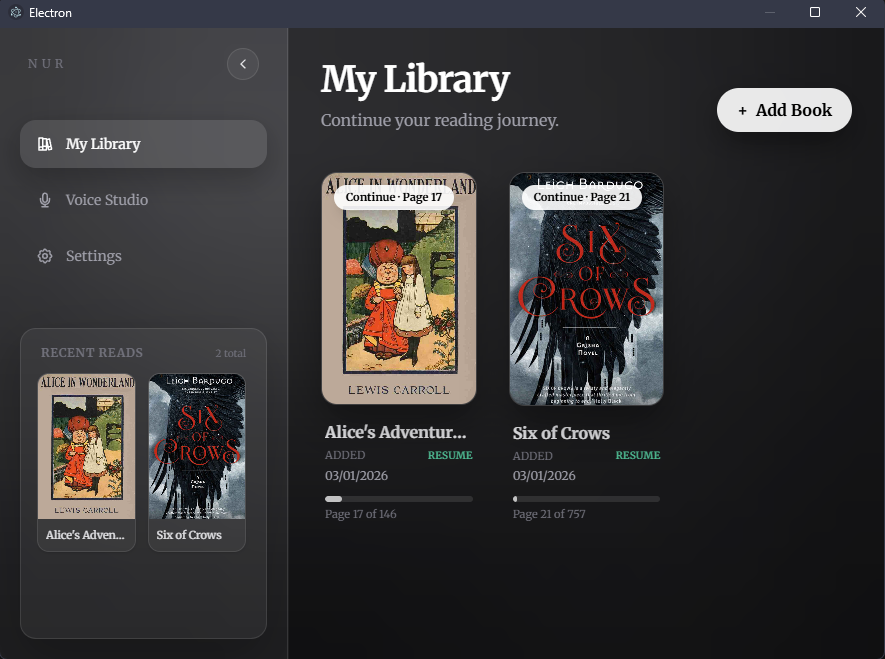

# Nur — Local AI Audiobook Player

Nur is a desktop app that turns EPUB ebooks into synchronized audiobooks locally, using offline AI Text-to-Speech engines. It focuses on privacy, speed, and a modern glass-style reading experience.



> Local-first. No cloud. Your books and voices stay on your machine.

## Features

- Local AI TTS: Coqui XTTS v2 (high quality) + Piper TTS (high speed).
- Voice Studio: Save voice samples and reuse them across books.
- Reader Sync: Highlights the currently spoken sentence in real time.
- Glass UI: Polished, modern interface with a focus on readability.
- Offline & Private: No external calls required for generation.

## Tech Stack

- Electron + React + TypeScript
- Tailwind CSS for UI
- FastAPI + PyTorch backend (packaged with PyInstaller)
- Electron IPC + local HTTP for engine communication

## Architecture

1. Electron main process launches the backend executable (`nur_backend`).
2. The Python server runs on `localhost:8000`.
3. The renderer requests audio per text segment and streams it to the player.

## Demo

- Screenshots: add to `docs/` and update this section.
- Video: link a short walkthrough here.

## Local Setup

### Install

```bash
npm install
```

### Development

```bash
npm run dev
```

### Build

```bash
# Windows
npm run build:win

# macOS
npm run build:mac

# Linux
npm run build:linux
```

## Repository Structure

```
src/
  main/        # Electron main process
  preload/     # Context bridge APIs
  renderer/    # React UI
nur_backend/   # FastAPI + TTS engines
resources/     # Packaged assets (engine, default speaker)
```

## Notes

- XTTS downloads its model on first run (cached in the user directory).
- Piper downloads into the app data folder via the in-app downloader.

## Roadmap

- [ ] Voice sample preview playback
- [ ] Export audiobook chapters
- [ ] Reading analytics and bookmarks

## License

MIT (or specify your preferred license)
