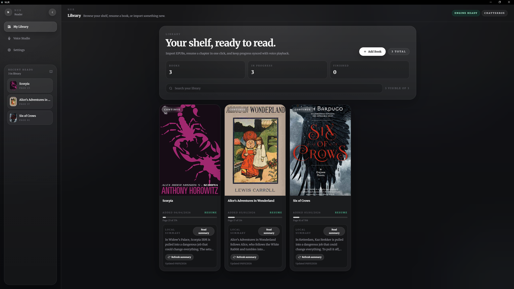
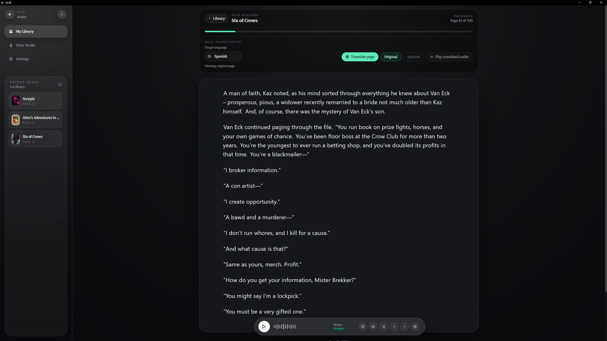
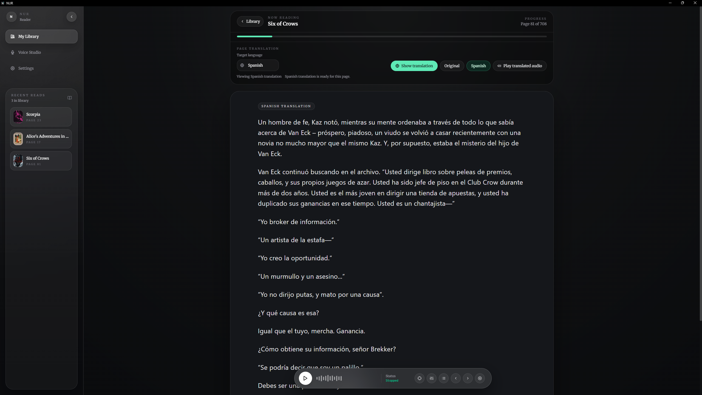
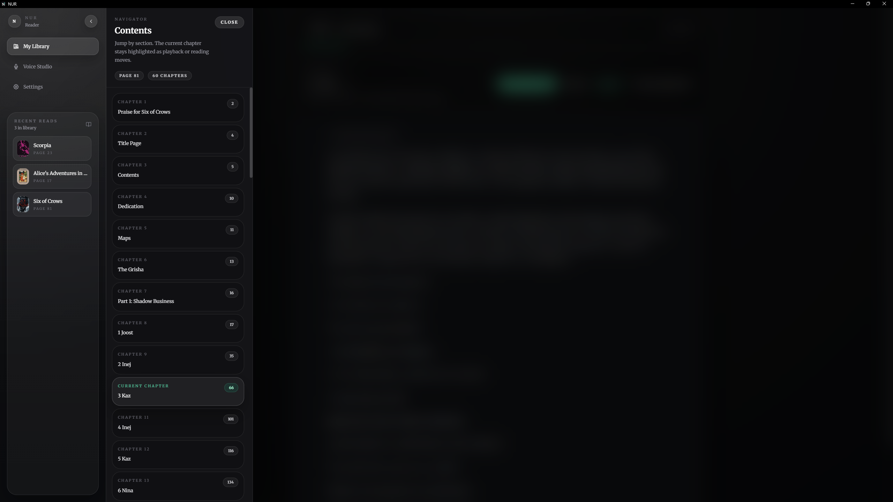
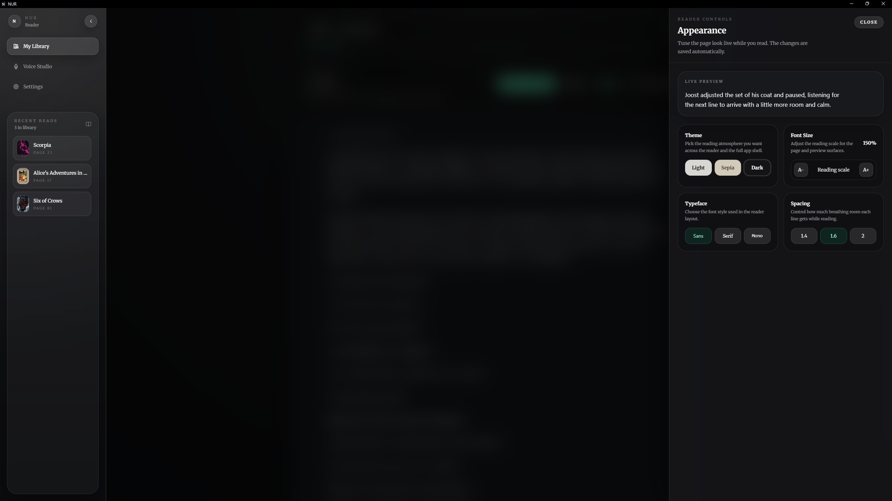
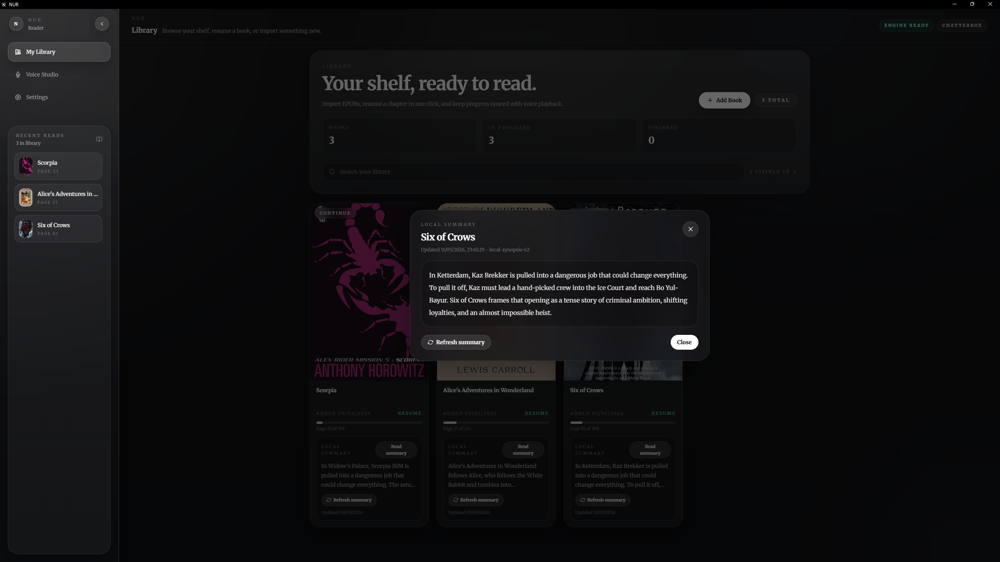

# Nur

Nur is a local-first desktop EPUB reader that turns books into private, synchronized audiobooks.

It combines an EPUB library, local text-to-speech, sentence highlighting, page translation, voice management, and book summaries in one desktop app. The goal is simple: make reading and listening feel seamless without sending a user's books or voice data to a cloud service.







<video src="docs/video.mp4" width="320" height="240" controls></video>

> Local-first. Private by default. Your books, voices, summaries, settings, and reading state stay on your machine.

## Why Nur Exists

Most AI reading tools are cloud-based, subscription-based, or not designed for long-form EPUB reading. Nur explores a different approach: a free, open-source desktop reader where the reading experience, speech generation, and supporting AI features run locally.

Nur is built for readers who want:

- a private way to listen to EPUB books
- synchronized read-along highlighting
- local voices instead of cloud TTS APIs
- adjustable reading appearance and playback behavior
- multilingual reading help without leaving the book
- an installable desktop app rather than a collection of scripts

## Current Features

### Library

- Import and manage EPUB books locally
- Save reading progress per book
- Resume books from the library or recent reads
- Search the local library
- Generate and read local book summaries
- Store cover art, metadata, progress, and summary state locally

### Reader

- Paginated EPUB reading view
- Stable page restoration when resizing the window
- Sentence-level highlighting synchronized with spoken narration
- Automatic page turn when playback reaches the end of a page
- Table of contents navigation
- Appearance controls for:
  - light, sepia, and dark themes
  - font size
  - typeface
  - line spacing
- Reader appearance settings are persisted and applied across the wider app UI

### Local Text-to-Speech

Nur supports two local narration paths:

- `Piper`: the fast default engine for responsive local playback on most machines
- `Chatterbox`: a higher-quality local narration option for stronger hardware

Playback features include:

- smooth buffering for long-form reading
- stop, pause, resume, and page-to-page continuation
- sentence-aligned audio generation for accurate highlighting
- playback settings for speed, quality mode, buffering, and low-end devices

### Voice Studio

- Add reusable voice samples
- Store local voice presets
- Select active voice references for supported narration workflows
- Keep voice assets on the user's machine

### Translation

- Translate the current page locally into:
  - Spanish
  - French
  - Arabic
- Preview translated text inside the reader
- Play translated text using matching local Piper voices
- RTL-aware display for Arabic

### Local Summaries

- Extract clean EPUB content locally
- Generate a short synopsis for each book in the library
- Show the full summary in an accessible modal
- Refresh summaries when needed

The summary feature currently uses Nur's local synopsis pipeline (`local-synopsis-v2`) built around EPUB content extraction, premise detection, and structured summary generation. It is intentionally lightweight so it does not require loading a large LLM into memory.

### Desktop App Behavior

- Native Electron desktop shell
- App name, icon, and packaged resources configured
- Minimize-to-tray support on supported desktop platforms
- Local backend process management
- Dynamic local backend port selection to avoid port conflicts
- Runtime health checks, logs, and recovery actions
- Windows installer, macOS package, and Linux package build targets

## Privacy Model

Nur is designed to keep reading workflows local.

- EPUB files are imported and stored locally.
- Reading progress and settings are saved locally.
- Voice samples stay on the user's machine.
- TTS requests are handled by the local backend.
- Translation and summary generation are designed to run locally.

Some models are downloaded on first use and cached in the user's app data directory. After a model is cached, the related workflow can run locally without repeatedly downloading it.

Nur does not currently provide cloud sync, accounts, telemetry, or hosted inference.

## Model and Hardware Notes

`Piper` is the default path and is suitable for most machines. The default English Piper voice is prepared automatically and cached locally.

`Chatterbox` provides higher-quality narration but is heavier. A capable GPU is strongly recommended:

- Windows users will get the best premium-engine performance on a supported NVIDIA GPU.
- Apple Silicon can use local acceleration, but premium playback may need a longer startup buffer.
- CPU-only systems should use Piper for the smoothest experience.

Translation models and translated Piper voices are also prepared on first use for each supported language.

## Known Limitations

- DRM-protected EPUBs are not supported.
- OCR for scanned books is not currently included.
- Mobile builds are not currently targeted.
- Chatterbox quality and startup time depend heavily on local hardware.
- Unsigned builds may trigger Windows SmartScreen or macOS Gatekeeper warnings.
- Local model downloads require internet access the first time a model is prepared.

## Architecture

Nur is split into three main parts:

1. Electron main process
   Handles app windows, tray behavior, IPC, library persistence, packaging checks, model download orchestration, and backend process management.
2. React renderer
   Renders the library, reader, settings, Voice Studio, translation UI, summary UI, and playback controls.
3. Python backend
   Runs local generation services through FastAPI, including TTS, translation, and synopsis generation.

The renderer talks to Electron through a preload bridge. Electron handles trusted file/app operations and communicates with the local Python backend for generation tasks.

## Tech Stack

- Electron
- React
- TypeScript
- Vite / electron-vite
- Tailwind CSS
- FastAPI
- PyTorch / Transformers-based local model stack
- Piper TTS
- Chatterbox TTS
- PyInstaller for backend packaging
- electron-builder for desktop installers/packages

## Repository Layout

```text
src/
  main/        Electron main process, IPC, packaging/runtime orchestration
  preload/     Context bridge APIs exposed to the renderer
  renderer/    React UI for library, reader, settings, voice, translation
  shared/      Shared TypeScript contracts

nur_backend/
  nur_tts_backend/  FastAPI backend and local AI services

resources/     Runtime assets
build/         App icons and macOS entitlements
scripts/       Build, packaging, smoke, and release scripts
docs/          Project docs and assets
```

## Development Requirements

- Node.js 20+
- npm
- Python 3.10 or 3.11
- Platform-specific build tools for packaged releases

For Chatterbox development, a CUDA-capable NVIDIA GPU is recommended on Windows.

## Getting Started

Install JavaScript dependencies:

```bash
npm install
```

Run the app in development:

```bash
npm run dev
```

Prepare the packaged Python backend after backend changes:

```bash
npm run backend:prepare
```

## Build Commands

Create a standard frontend/main-process build:

```bash
npm run build
```

Create packaged builds:

```bash
# Unpacked build for local smoke testing
npm run build:unpack

# Windows NSIS installer
npm run build:win

# macOS DMG/ZIP build, must be run on macOS
npm run build:mac

# Linux AppImage/snap/deb targets
npm run build:linux
```

## Release Validation

Before publishing a release, run:

```bash
npm run lint
npm run typecheck
npm run release:check
npm run smoke:release
```

Then complete the manual QA flow in [RELEASE_CHECKLIST.md](RELEASE_CHECKLIST.md).

Important release checks:

- first launch on a clean machine
- Piper download/preparation and playback
- Chatterbox preparation and playback on supported hardware
- import, read, pause, resume, stop, and auto-page-turn behavior
- theme/settings persistence
- translation for supported languages
- local summary generation
- tray minimize and restore
- packaged backend startup
- installer trust/signing behavior on the target platform

## Packaging Notes

- The Python backend must be built on the same platform you intend to ship.
- `npm run build:mac` should be run on real macOS hardware.
- Apple Silicon and Intel macOS builds are handled separately by the current build flow.
- Windows builds currently target x64 NSIS installers.
- macOS signing/notarization requires Apple developer credentials.
- Unsigned releases can still be shared for testing, but users may see operating-system trust warnings.

## Project Status

Nur is currently a polished local-first EPUB + TTS desktop app moving toward public testing.

The core release experience is in place:

- local EPUB library
- synchronized sentence highlighting
- fast default TTS with Piper
- higher-quality Chatterbox narration path
- Voice Studio
- local page translation
- local book summaries
- persistent settings and themes
- packaged backend build flow
- desktop installer/package targets
- release checklist and smoke validation scripts

The main remaining work before a broader public release is cross-machine QA, especially on clean Windows installs, macOS hardware, and lower-end devices.

## Contributing

Contributions are welcome.

Before opening a PR, run:

```bash
npm run lint
npm run typecheck
npm run release:check
```

For packaging-related changes, also run:

```bash
npm run smoke:release
```

## License

MIT
